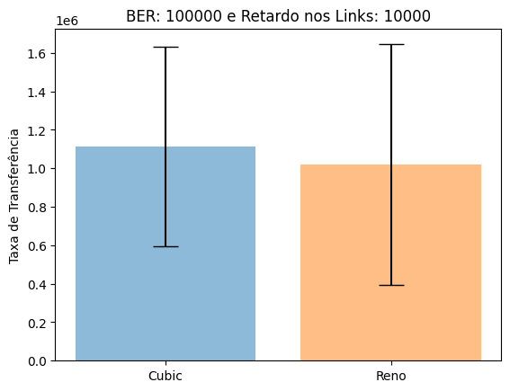
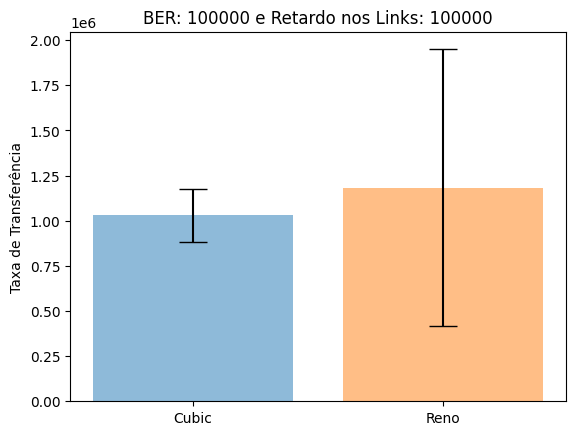
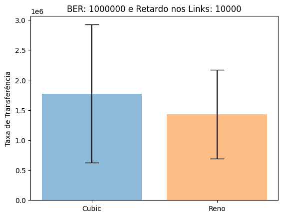
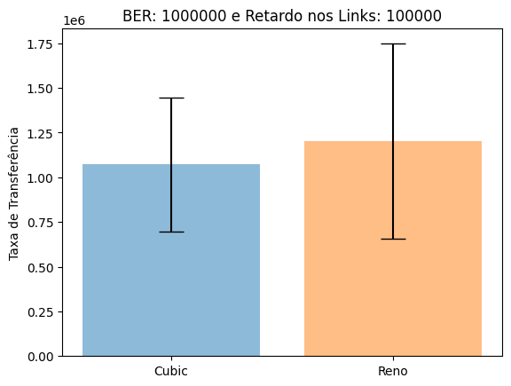

# Avaliação de Desempenho do Protocolo TCP em condições de congestionamento: cubic x reno

## Alunos

<a href="https://github.com/lucascraupp">
    <br />
    <sub><b>Lucas Coelho Raupp</b></sub></a><br />

&nbsp;

<a href="https://github.com/ArthurAnastopulos">
    <br />
    <sub><b>Arthur Anastopulos dos Santos</b></sub></a><br />

## Objetivo

Projetar um experimento para avaliar o comportamento de dois algoritmos de controle de congestionamento (cubic e reno) em uma dada topologia.


## Métricas

Taxa de transmissão média.

## Parâmetros fixados

- Tráfego de background UDP
- Cenário com fluxo TCP
- Links ethernet de 1Gbps.
- Intervalos de confiança de 99%

## Fatores e níveis

- Algorítmo de congestionamento
  - Cubic
  - Reno
- BER
  - 1/1e5
  - 1/1e6
- Retardo no link entre roteadores
  - 10ms
  - 100ms

## Técnicas usadas para avaliação

Simulações realizadas através dos softwares Imunes e IPERF

***

## Amostra dos dados obtidos


```python
import numpy as np
import pandas as pd
import matplotlib.pyplot as plt
```


```python
data = pd.read_csv("data/dados.csv")

data.head()
```


<div>
<style scoped>
    .dataframe tbody tr th:only-of-type {
        vertical-align: middle;
    }

    .dataframe tbody tr th {
        vertical-align: top;
    }

    .dataframe thead th {
        text-align: right;
    }
</style>
<table border="1" class="dataframe">
  <thead>
    <tr style="text-align: right;">
      <th></th>
      <th>Repetição</th>
      <th>Protocolo</th>
      <th>BER</th>
      <th>Delay</th>
      <th>Largura de Banda UDP</th>
      <th>Timestamp</th>
      <th>IP PC1</th>
      <th>Porta PC1</th>
      <th>IP PC2</th>
      <th>Porta PC2</th>
      <th>ID</th>
      <th>Intervalo</th>
      <th>Taxa de Transferência</th>
      <th>Largura de Banda TCP</th>
    </tr>
  </thead>
  <tbody>
    <tr>
      <th>0</th>
      <td>0</td>
      <td>cubic</td>
      <td>100000</td>
      <td>10000</td>
      <td>10M</td>
      <td>20240318150617</td>
      <td>10.0.0.20</td>
      <td>35142</td>
      <td>10.0.1.20</td>
      <td>5001</td>
      <td>3</td>
      <td>0.0-10.5</td>
      <td>786432</td>
      <td>598366</td>
    </tr>
    <tr>
      <th>1</th>
      <td>0</td>
      <td>cubic</td>
      <td>100000</td>
      <td>100000</td>
      <td>10M</td>
      <td>20240318150630</td>
      <td>10.0.0.20</td>
      <td>51460</td>
      <td>10.0.1.20</td>
      <td>5001</td>
      <td>3</td>
      <td>0.0-11.8</td>
      <td>917504</td>
      <td>621544</td>
    </tr>
    <tr>
      <th>2</th>
      <td>0</td>
      <td>cubic</td>
      <td>1000000</td>
      <td>10000</td>
      <td>10M</td>
      <td>20240318150644</td>
      <td>10.0.0.20</td>
      <td>37122</td>
      <td>10.0.1.20</td>
      <td>5001</td>
      <td>3</td>
      <td>0.0-13.9</td>
      <td>1179648</td>
      <td>677528</td>
    </tr>
    <tr>
      <th>3</th>
      <td>0</td>
      <td>cubic</td>
      <td>1000000</td>
      <td>100000</td>
      <td>10M</td>
      <td>20240318150656</td>
      <td>10.0.0.20</td>
      <td>40512</td>
      <td>10.0.1.20</td>
      <td>5001</td>
      <td>3</td>
      <td>0.0-11.9</td>
      <td>786432</td>
      <td>528411</td>
    </tr>
    <tr>
      <th>4</th>
      <td>0</td>
      <td>reno</td>
      <td>100000</td>
      <td>10000</td>
      <td>10M</td>
      <td>20240318150709</td>
      <td>10.0.0.20</td>
      <td>51480</td>
      <td>10.0.1.20</td>
      <td>5001</td>
      <td>3</td>
      <td>0.0-12.3</td>
      <td>786432</td>
      <td>509476</td>
    </tr>
  </tbody>
</table>
</div>


## Plotagem dos gráficos


```python
def get_interval(data: pd.DataFrame, protocol: str):
    """ P(-z < Z < z)
    μ - t * (σ / √n) < Z < μ + t * (σ / √n)
    """

    mean = data.mean()
    standard_deviation = data.std()
    n = data.count()
    t = 3.355 # 99% de confiança (tabela t-student)

    confidence_interval = t * (standard_deviation/np.sqrt(n))

    inferior_limit = mean - confidence_interval
    superior_limit = mean + confidence_interval

    absolute_inferior = inferior_limit.iloc[0]/1e6
    absolute_superior = superior_limit.iloc[0]/1e6

    print(f"Limites do intervalo de confiança para o protocolo {protocol}: {absolute_inferior:.3}e6 - {absolute_superior:.3}e6")

    return confidence_interval

for ber in data["BER"].unique():
    for delay in data["Delay"].unique():
        data_cubic = data[(data["BER"] == ber) & (data["Delay"] == delay) & (data["Protocolo"] == "cubic")]
        data_cubic = pd.DataFrame(data_cubic["Taxa de Transferência"])
        data_reno = data[(data["BER"] == ber) & (data["Delay"] == delay) & (data["Protocolo"] == "reno")]
        data_reno = pd.DataFrame(data_reno["Taxa de Transferência"])

        confidence_interval_cubic = get_interval(data_cubic, "cubic")
        confidence_interval_reno = get_interval(data_reno, "reno")

        plt.bar("Cubic", data_cubic.mean(), yerr=confidence_interval_cubic, align='center', alpha=0.5, capsize=10)
        plt.bar("Reno", data_reno.mean(), yerr=confidence_interval_reno, align='center', alpha=0.5, capsize=10)

        plt.title(f"BER: {ber} e Retardo nos Links: {delay}")
        plt.ylabel("Taxa de Transferência")
        plt.show()
```

    Limites do intervalo de confiança para o protocolo cubic: 0.595e6 - 1.63e6
    Limites do intervalo de confiança para o protocolo reno: 0.393e6 - 1.64e6


    

    


    Limites do intervalo de confiança para o protocolo cubic: 0.88e6 - 1.18e6
    Limites do intervalo de confiança para o protocolo reno: 0.414e6 - 1.95e6


    

    


    Limites do intervalo de confiança para o protocolo cubic: 0.622e6 - 2.92e6
    Limites do intervalo de confiança para o protocolo reno: 0.69e6 - 2.17e6


    

    


    Limites do intervalo de confiança para o protocolo cubic: 0.698e6 - 1.44e6
    Limites do intervalo de confiança para o protocolo reno: 0.658e6 - 1.75e6


    

    


***

## Análise dos resultados

### Tabela Cubic x Reno

|   Cubic (Mbps) |   Reno (Mbps) |
|:--------------:|:-------------:|
|           1.11 |          1.02 |
|           1.03 |          1.18 |
|           1.77 |          1.43 |
|           1.07 |          1.20 |

### Conclusões

A simulação que apresentou a melhor taxa de transmissão foi a representada pelo terceiro gráfico. Com os seguintes dados:
- Protocolo: Cubic
- BER: 1/1e6
- Retardo nos links: 10 ms
- Taxa média de transmissão: 1,77 Mbps

A simulação que apresentou a pior taxa de transmissão foi a representada pelo primeiro gráfico. Com os seguintes dados:
- Protocolo: Reno
- BER : 1/e5
- Retardo nos links: 10 ms
- Taxa média de transmissão: 1.02 Mbps
